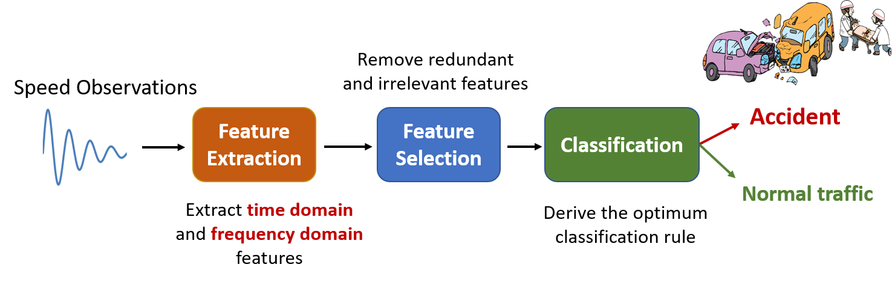

# Introduction

This project focuses on near real–time accurate recognition of freeway accidents using speed data measured from speed sensors located across the freeway. Due to the significant impact of road accidents on health and development, early and accurate detection of accidents is crucial. Specifically, National Safety Council estimates around 40,000 people lost their lives due to car crashes in 2019 which is a 6% increment in the number of deaths when it compared with 2015. Traffic accidents also cause tremendous loss in terms of time and energy. The Texas Transportation Institute reports that congestion causes Americans to travel an extra $8.8 billion hours and purchase an extra $3.3 billion gallons of fuel for a congestion cost of $166 billion.

The goal of this project is to detect accidents in near real–time using informative features hidden in noisy speed observations. Specifically, our proposed method constitutes three stages: 

[1. Description of Data](./pages/data_descrip.html)

[2. Data Collecting and Processing](./pages/data_collect.html)

[3. Feature Extraction](./pages/feat_extract.html)

[4. Feature Selection](./pages/feat_select.html)

[5. Classification](./pages/classify.html)

