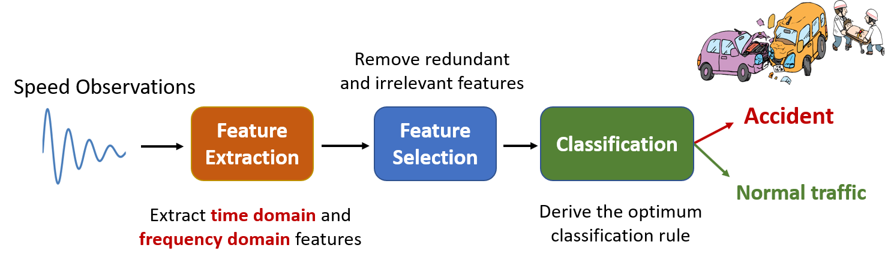

# Introduction

This project focuses on near real–time accurate recognition of freeway accidents using speed data measured from speed sensors located across the freeway. Due to the significant impact of road accidents on health and development, early and accurate detection of accidents is crucial. Specifically, National Safety Council estimates around 40,000 people lost their lives due to car crashes in 2019 which is a 6% increment in the number of deaths when it compared with 2015 [^1]. Traffic accidents also cause tremendous loss in terms of time and energy. The Texas Transportation Institute reports that congestion causes Americans to travel an extra $8.8 billion hours and purchase an extra $3.3 billion gallons of fuel for a congestion cost of $166 billion [^2].

The goal of this project is to detect accidents in near real–time using informative features hidden in noisy speed observations. Specifically, our proposed method constitutes three stages: 

# Content 

[1. Literature Review](./pages/review.html)

[2. Description of Data](./pages/data_descrip.html)

[3. Data Collecting and Processing](./pages/data_collect.html)

[4. Feature Extraction](./pages/feat_extract.html)

[5. Feature Selection](./pages/feat_select.html)

[6. Optimum Classification](./pages/classify.html)

[7. Experiments and Results](./pages/results.html)

# Conclusion
* We proposed a three stage approach to accurately and timely detect freeway accidents based on speed data. 
  1. Feature Extraction: Extracted both time domain and frequency domain features.
  2. Feature Selection: Selected a subset of highly correlated features with the accident variable.
  3. Optimum Classification: Defined an optimization interms of the Bayes risk associated with the classification decision. The optimum solution was derived.
* Evaluation results showed that our proposed method achieves an improvement of up to 77.2% in average detection delay compared to reported accident times by California Highway Patrol.
* Possible extensions:
  1. In this study, we consider on detecting accidents as a binary variable. Instead, can be extended to detect the level of severity once an accident occurs.
  2. We assume features to be independent conditioned on the accident variable. Considering both spatial and temporal dependencies amoung features would definitely be an interesting area for future work.
  
## Acknowledgements
We would like to thank [Dr. Hany Elgala](https://www.albany.edu/~HE895353/), [Monette Khadr](https://www.albany.edu/~HE895353/monette.html) for thier valuable comments and [Dr. Daphney-Stavroula Zois](https://www.albany.edu/~dz973423/) for giving access to real-time speed data provided by the California Department of Transportation.

### References
[^1]: Nationa Safety Council, “NSC Motor Vehicle Fatality Estimates,” 2019, Available at: [https://injuryfacts.nsc.org/motor-vehicle/overview/preliminary-estimates/](https://injuryfacts.nsc.org/motor-vehicle/overview/preliminary-estimates/)

[^2]: Texas Transportation Institute, “2019 Urban Mobility Report,” 2019, [Online]. Available at: [https://static.tti.tamu.edu/tti.tamu.edu/documents/mobility-report-2019.pdf](https://static.tti.tamu.edu/tti.tamu.edu/documents/mobility-report-2019.pdf)

