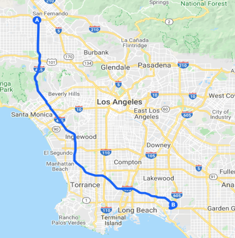
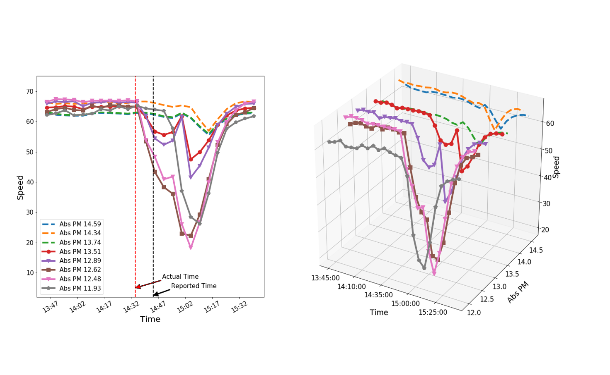
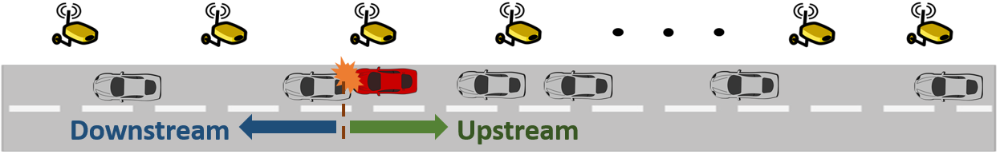

# Data Collecting

We have collected real-data provided by the California Department of Transportation, and  the California Highway Patrol, during the month of January 2020 in North direction of the I-405 freeway in the Los Angeles County. 

<p align="center">
  
</p>
    
1. Speed Dataset:  We have created a big-dataset comprising of 1,446,196 speed readings collected from all 162 sensors.
  - Sampling time = 5 minutes
  - No. of missing samples = 140

2. Event Dataset:  We have created a dataset comprising details from all 1163 accidents happened. Details include:
  - Reported time of the accident
  - Duration of the accident
  - Accident location
  
<details>
  <summary> <b> Show Code </b> </summary>
  
```python
import pandas as pd
import datetime

######################################  Speed Dataset #########################################
new = pd.DataFrame()
Speed_data = []

#read all 31 files, each file contains speed readings from a single day in Jan 2020
for i in range(1,32): 
    data_xls = pd.read_excel('Speed_data/pems_output-'+str(i)+'.xlsx', index_col=None)
    new = data_xls[['Time','Postmile (Abs)','VDS','AggSpeed', '% Observed']]
    new = new.rename(index=str, columns={"Time":"Time","Postmile (Abs)": "Postmile",
                              "VDS":"Link_ID","AggSpeed": "Speed","% Observed": "Accuracy"})    
    date = datetime.date(2020,1,i)        
    new['Time'] = pd.to_datetime(date.strftime('%Y-%m-%d:') + new['Time'], format='%Y-%m-%d:%H:%M')
    Speed_data.append(new)

#save all speed readings into a single .csv file
Speed_data = pd.concat(Speed_data, axis=0)
Speed_data.to_csv('Speed_2020_Jan.csv', encoding='utf-8',index=False)

######################################  Event Dataset #########################################
new = pd.DataFrame()
Event_data = []

#read all 5 files, each file contains all accident details happended in a week in Jan 2020
for i in range(1,6):
    
    data_xls = pd.read_excel('Accidents/pems_output-'+str(32+i)+'.xlsx', index_col=None)
    new = data_xls[['Incident Id','Start Time','Duration (mins)','Abs PM','DESCRIPTION']]
    new = new.rename(index=str, columns={"Incident Id":"Incident_ID","Start Time": "Start_Time", 
                     "Duration (mins)":"Duration","Abs PM": "Postmile","DESCRIPTION": "DESCRIP"})
   
    new['Start_Time'] = pd.to_datetime(new['Start_Time'], format='%m-%d-%y %H:%M')   
    Event_data.append(new)

#save all event data into a single .csv file
Event_data = pd.concat(Event_data, axis=0)
Event_data.to_csv('Event_2020_Jan.csv', encoding='utf-8',index=False)
```
</details>
  
# Data Processing and Visualizing

During data processing, we utilize a liner interpolation filter to handle missing samples.  The below figure shows speed data from an accident reported on absolute postmile (Abs PM) 13.6 at 2:44pm on January 1st, 2020. 



<details>
  <summary> <b> Show Code </b> </summary>
  
```python
def plot_raw_speed(Speed_data,Event_data,event_id):
    """
    Plot raw speed in a 2d figure
    Args:
        Speed_data: Speed dataset 
        Event_data: Event dataset
        event_id: Unique id of the event that need to be plot
    Return: 
        None: Plot raw speed readings corresponding to event defined by "event_id" and save it as .png
    """ 
    #accident information
    Event_info = Event_data[Event_data['Incident_ID'] == event_id]    
    Acc_time = Event_info.iloc[0,1]
    Acc_place = Event_info.iloc[0,3]
    

    #extract speed data 1 hour before and after, and within 3 miles range from accident
    start_t = Acc_time - timedelta(minutes= 80) 
    end_t = Acc_time + timedelta(minutes=40)      
    Event_speed =  Speed_data[(Speed_data.Postmile >= Acc_place - 1.5  ) & 
                              (Speed_data.Postmile <= Acc_place +0.2 ) &
                          (Speed_data.Time <=  end_t  ) & 
                          (Speed_data.Time >= start_t)]        
    Link_IDS = Event_speed['Link_ID'].drop_duplicates().values.tolist()
    
    # 2d figure
    fig = plt.figure(figsize=(10,10))
    ax = fig.add_subplot(1,1,1) 
    
    for z in range(0,len(Link_IDS)): 
    
        #extract sensor speed data
        Link_data = Event_speed[Event_speed['Link_ID']== Link_IDS[z]]
        Post = Link_data.Postmile.values[0]                                   
        data = Link_data[['Time','Speed']]
        sorted_data = data.sort_values(['Time'])
        sorted_data1 = sorted_data.set_index(['Time'])   
        
        #interpolation filter incase of missing samples
        resampled_data = sorted_data1.resample('5T').mean()  
        interpolated = resampled_data.interpolate(method='linear')
        
        
        if Post  > Acc_place: #upstream sensors
             plt.plot(interpolated.index,interpolated.Speed,'--',linewidth=4,
                                                      label='Abs PM '+str(round(Post,2)))
        else:               #downstream sensors
            plt.plot(interpolated.index,interpolated.Speed,marker=Marker[z-2],linewidth=4,ms=8.0,
                                                     mew = 2.0,label='Abs PM '+str(round(Post,2)))
            
    
    #annotate actual time and reported time
    plt.annotate('Actual Time', xy=((Acc_time- timedelta(minutes= 40)), 5), color='red',
                     xytext=((Acc_time - timedelta(minutes = 75)),8),
                arrowprops=dict(facecolor='red', shrink=0.01,width=2),fontsize=15)  
    plt.axvline(x=(Acc_time- timedelta(minutes= 40)),color='r',linestyle='--',linewidth=3,label = '')   
    plt.annotate('Reported Time \n (Delay = 40 mins)', xy=((Acc_time), 3), 
                     xytext=((Acc_time + timedelta(minutes = 10)),5),
                arrowprops=dict(facecolor='black', shrink=0.01,width=2),fontsize=15)
    plt.axvline(x=Acc_time,color='k',linestyle='--',linewidth=2,label = '')

    #stylish adjustments in plot
    ax.xaxis.set_major_formatter(mdates.DateFormatter('%H:%M'))     
    plt.ylim(2,75)  
    plt.xticks(rotation=30)
    plt.legend(fontsize=15)
    plt.rcParams['xtick.labelsize'] = 15
    plt.rcParams['ytick.labelsize'] = 15
    plt.xlabel('Time',fontsize=20)
    plt.ylabel('Speed',fontsize=20)

    #save figure    
    plt.savefig('Figures/result.png', format='png')

def D3_plot_raw_speed(Speed_data,Event_data,event_id):
    """
    Plot raw speed in a 3d figure
    Args:
        Speed_data: Speed dataset 
        Event_data: Event dataset
        event_id: Unique id of the event that need to be plot
    Return: 
        None: 3d Plot raw speed readings corresponding to event defined by "event_id" and save it as .png
    """ 
    #accident information
    Event_info = Event_data[Event_data['Incident_ID'] == event_id]    
    Acc_time = Event_info.iloc[0,1]
    Acc_place = Event_info.iloc[0,3]
    
    #extract speed data 1 hour before and after, and within 3 miles range from accident
    start_t = Acc_time - timedelta(minutes= 60) 
    end_t = Acc_time + timedelta(minutes=60)       
    Event_speed =  Speed_data[(Speed_data.Postmile >= Acc_place - 2  ) & 
                              (Speed_data.Postmile <= Acc_place +1 ) &
                          (Speed_data.Time <=  end_t  ) & 
                          (Speed_data.Time >= start_t)]     
    Link_IDS = Event_speed['Link_ID'].drop_duplicates().values.tolist()
      
    
    #3d figure
    fig = plt.figure(figsize=(12,12))
    ax = fig.add_subplot(111, projection='3d')
    
    for z in range(0,len(Link_IDS)): #get speed reading from all sensors
        
        #extract sensor speed data
        Link_data = Event_speed[Event_speed['Link_ID']== Link_IDS[z]]
        Post = Link_data.Postmile.values[0]                                      
        data = Link_data[['Time','Speed']]
        sorted_data = data.sort_values(['Time'])
        sorted_data1 = sorted_data.set_index(['Time'])   
        
        #interpolation filter incase of missing samples
        resampled_data = sorted_data1.resample('5T').mean()  
        interpolated = resampled_data.interpolate(method='linear')
        
        index = [i for i in range(len(interpolated.index))]
        LK = [Post for i in range(len(interpolated.index))]
        
        if Post  > Acc_place: #upstream sensors         
            ax.plot(index, LK,interpolated.Speed,'--', linewidth=4)
        else:                #downstream sensors 
            ax.plot(index, LK,interpolated.Speed,marker=Marker[z-2],
                                                linewidth=4,ms=8.0,mew = 2.0)
    
    #stylish adjustments in plot 
    tick = np.arange(0, len(interpolated.index), 5)
    label = [interpolated.index.time[i] for i in tick]
    ax.xaxis.set_ticks(tick)
    ax.xaxis.set_ticklabels(label)  
    ax.set_ylabel('Abs PM',fontsize = 17)
    ax.set_xlabel('Time',fontsize = 17)
    ax.set_zlabel('Speed',fontsize =17)   
    ax.xaxis.labelpad = 20
    ax.yaxis.labelpad = 20
    
    #save figure
    plt.savefig('Figures/3D_Raw_Speed.png', format='png')
      
 ```
</details>

In this figure, solid lines represent speed readings from upstream sensors, while dashed lines represents speed readings from downstream sensors.  



[Go Back](../)
