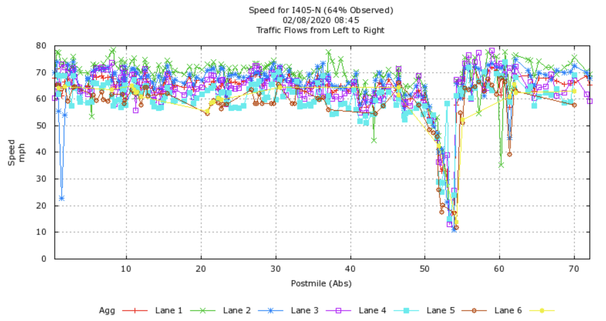
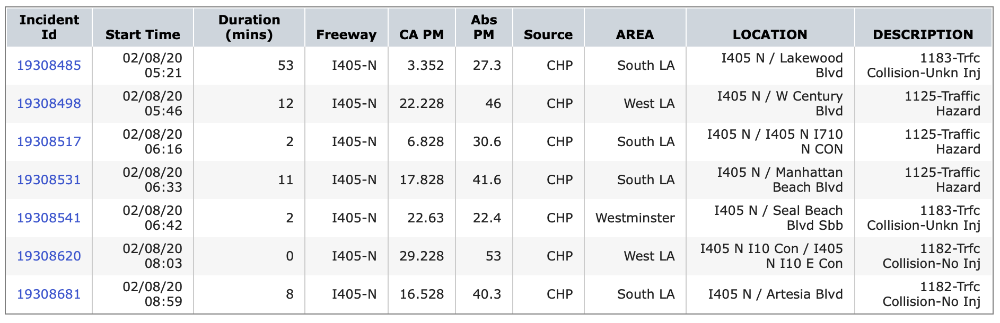

The data utilized in this study comprise freeway traffic data collected in real–time. Specifically, we have access to two sources of data: i) speed readings of loop sensors from several freeways covering a total of 41,236 miles in California provided by the California Department of Transportation [^1], and ii) reported accidents along the same freeways provide by California Highway Patrol [^2].

## Speed Data
Sensors are located approximately every 0.5 miles along the freeway in both North and South
directions. For a given sensor, a speed reading is provided for each 5 minutes everyday, and includes details
such as sensor location, time and date of the speed reading, and freeway direction (i.e., North or South). Fig. 1
shows speed data from I405 freeway North direction observed at 8.45 am on 08th February 2020.

## Accident Data 
Details of accidents include the start time of the accident, the duration, a description of the accident type, the freeway direction (i.e., North or South) and the accident location in terms of absolute post mile. In general, the reported accident time constitutes a delayed version of the actual time that the accident took place. Fig. 2 shows events reported on I405 Freeway North direction from 5 a.m. to 10 a.m. on 08th February 2020.

[Go Back](../)

### References
[^1]: California Department of Transportation, “Caltrans,”  Available at: [https://dot.ca.gov/](https://dot.ca.gov/)

[^2]: California Highway Patrol, “CHP,” Available at: [https://www.chp.ca.gov/home](https://www.chp.ca.gov/home)
