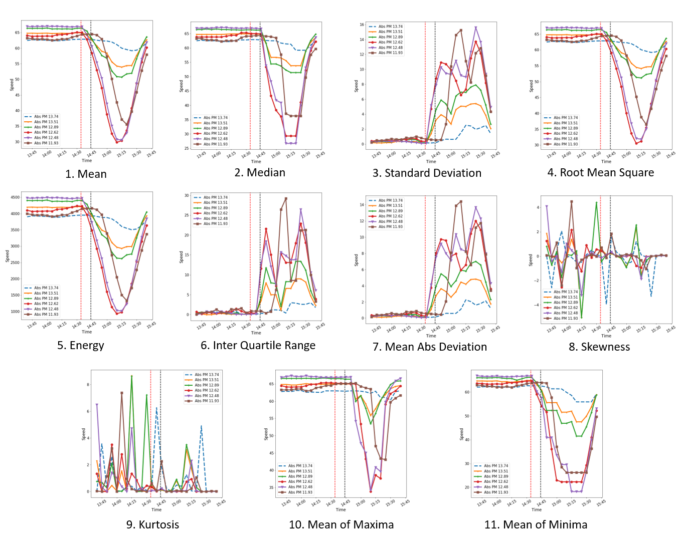

Various informative (time domain and frequency domain) features can be extracted from the raw speed readings that can facilitate the detection of accidents. 

# Time-Domain Features

We conisder 11 time-domain features:
<pre>
1. Mean                             7. Mean Absolute Deviation
2. Median                           8. Skewness
3. Standard deviation               9. Kurtosis
4. Root mean square                 10. Mean of Maxima
5. Energy                           11. Mean of Minima
6. Inter Quartile Range
</pre>

All features are computed via a rolling window approach. For example, feature mean is computed as follows:

 

  
 

 
The below figure shows the time-domain features extracted from the speed reading related to the accident that reported on absolute postmile (Abs PM) 13.6 at 2:44pm on January 1st, 2020. [See Figure](../pages/data_collect.html)]
 
 

  
 

[Back](../)
