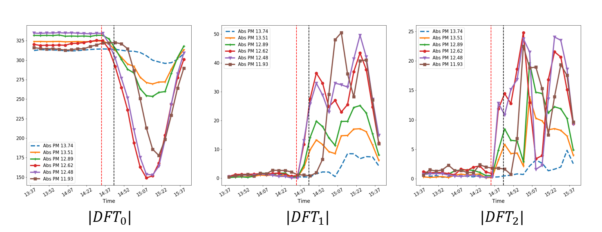

Various informative (time domain and frequency domain) features can be extracted from the raw speed readings that can facilitate the detection of accidents. 

# Time-Domain Features

We consider 11 time-domain features:
<pre>
1. Mean                             7. Mean Absolute Deviation
2. Median                           8. Skewness
3. Standard deviation               9. Kurtosis
4. Root mean square                 10. Mean of Maxima
5. Energy                           11. Mean of Minima
6. Inter Quartile Range
</pre>


These features are computed via a rolling window approach. For example, feature ''Mean'' is computed as follows:

$$ Z_k = \frac{\sum_{i=0}^{N-1} Y_{k-i}}{N}, $$

where $Z_k$ is the feature at time $k$, $Y_k$ is the speed reading at time $k$, and $N$ is the window length. 

<details> <summary> <b> Show Code </b> </summary>

```python
def time_roll_feat(x,feat,window):
    """
    Compute rolling window time domain features
    Args:
        x: raw speed array 
        feat: feature number
        window: window length N
    Return: 
        Feat: feature array
    """ 
    Feat = []
    
    for i in range(window-1,len(x)):
        b = np.array(x[i-window+1:i+1])
        
        if feat==1:     #mean         
            Feat.append(np.mean(b))
        
        if feat==2:     #median           
            Feat.append(np.median(b))
       
        if feat==3:      #std
            Feat.append(np.std(b))
            
        if feat==4:      #rms
            Feat.append(np.sqrt(np.mean(np.power(b,2))))
            
        if feat==5:      #energy
            Feat.append(np.mean(np.power(b,2)))
            
        if feat==6:      #IQR    
            Feat.append(np.percentile(b,75)-np.percentile(b,25))

        if feat==7:      #mean absolute deviation
            Feat.append(np.mean(np.abs(b - np.mean(b))))
            
        if feat==8:      #skewness
            b = pd.Series(b)
            d = np.divide((b[2]-b.mean()),b.std())
            d = np.power(d,3)
            Feat.append(d)

        if feat==9:      #kurtorsis
            b = pd.Series(b)
            d = np.divide((b[2]-b.mean()),b.std())
            d = np.power(d,4)
            Feat.append(d)
        
        if feat==10:     #mean of maxima
            a=(argrelextrema(b, np.greater_equal))
            d = (b[a])
            Feat.append(np.median(d))
   
        if feat== 11:    #mean of minima
            a=(argrelextrema(b, np.less_equal))
            d = (b[a])
            Feat.append(np.median(d))
    return Feat
    
```
</details>
 
The below figure shows the extracted time-domain features when $N=5$, for the accident reported on absolute postmile (Abs PM) 13.6 at 2:44pm on January 1st, 2020. See the coressponding raw speed readings [here.](./data_collect.html)


 
To plot time domain features, we use the same function that generates the plot of raw speed readings of an event (see [here.](./data_collect.html)), by replacing raw speed array with feature array.  

# Frequency-Domain Features

1. Discrete Fourier Transform [^1]
 
   We compute the discrete fourier transform by consider a window of size $N$ at each time $k$ as follows:
   
   $$ \text{DFT}^k_n = \sum_{i=0}^{N-1} Y_{k-i} e^{-j\frac{2\pi}{N}ni},$$
   
   where $\text{DFT}_n^k$ is the $n$th frequency component at time $k$.

   Since the speed observations are real values, we get a symmetric spectrum aroung $N/2$. Hence, we consider magnitudes of the d.c. component or the zero frequency component $\text{DFT}_0^k$, the fundermental frequency component $\text{DFT}_1^k$ and all its harmonics up to $N/2$ as features at time $k$. 

   Further, to speed-up the process of computing these features, we utilize a fast-fourier transform algorithm, i.e., Cooley-Tukey algorithm to compute discrete fourier transform, which reduce the number of computations from $\mathcal{O}(N^2)$ to $\mathcal{O}(Nlog(N))$ [^1]. 
   
   The below figure shows the extracted frequency components (magnitudes) when $N=5$, for the accident reported on absolute postmile (Abs PM) 13.6 at 2:44pm on January 1st, 2020. See the coressponding raw speed readings [here.](./data_collect.html)

   <p align="center">
       
   </p>

2. Karhunen Lo\'eve Expansion (Eigenvector Transform) [^2]

   The Karhunen Lo\'eve Expansion (KLE) decomposes a time-domain signal into uncorrelated spectral components to highlight its unique frequency domain characteristics.

   Let $Y^k =[Y_{k},Y_{k-1},\dots,Y_{k-N-1}]$ be the signal window of size $N$ at time $k$. Consider $\lbrace q_{0},q_{1},\dots,q_{N-1} \rbrace $ to be the eigen vectors of the $N \times N$ autocorrelation matrix corresponding to $Y^k$. Then the KLE of the signal $Y^k$ is given by,

   $$ Y^k =\sum_{i=0}^{N-1} q_{i}^{T} Y^k q_{i}.$$

   Thus, signal $Y^k$ is decomposed into $N$ mutually uncorrelated spectral components $\text{KLE}_0^k, \text{KLE}_1^k, \dots$, where $\text{KLE}_i^k= q_i^T Y^k q_i$. These uncorrelated spectral components are called the subspace components of the signal $Y^k$. We consider all these subspace components as features at time $k$.

   Note that each eigenvector $q_{i}$ can be viewed as coefficients of a Finite Impulse Response (FIR) digital filter and thus, $\text{KLE}_i^k$ is the output of the filter realized by $q_{i}$.
   
   The below figure shows the extracted subspace components when $N=5$, for the accident reported on absolute postmile (Abs PM) 13.6 at 2:44pm on January 1st, 2020. See the coressponding raw speed readings [here.](./data_collect.html)
 
   <p align="center">
  	 
   </p>

<details> <summary> <b> Show Code </b> </summary>

```python
def FFT(x):
    """
    Compute Fast Fourier Transform (FFT) of a window
    Args:
        x: a window of raw speed data 
    Return: 
        fft: magnitudes of the frequency components
    """ 
    return abs(np.fft.rfft(x))

def KLE(x): 
    """
    Compute Karhunen Lo'eve Expansion (KLE) a.k.a. Eigenvector Transform of a window
    Args:
        x: a window of raw speed data 
    Return: 
        klt: subspace components (i.e., the output of eigen transform)
    """ 
    corr = np.correlate(x, x, mode='full')
    auto_corr =  corr[corr.size//2:]
    corr_mat = toeplitz(auto_corr)
    eig_mat = np.linalg.eig(corr_mat)[1]   
    kle = np.matmul(np.transpose(eig_mat),x)             
    return abs(kle)


def freq_roll_feat(x,feat,window,index):
    """
    Compute rolling window frequency domain features: FFT / KLE
    Args:
        x: raw speed array 
        feat: feature name ('kle' or 'fft')
        window: window length N
        index: index of the frequency component (for FFT) / subspace component (for KLE)
    Return: 
        Feat: feature array 
    """ 
    Feat = []
    
    for i in range(window-1,len(x)):
        b = np.array(x[i-window+1:i+1])
            
        if feat=='kle': #KLE expansion features
            klt = KLT(b)
            Feat.append(klt[index])
           
        if feat=='fft': # FFT features
            fft = FFT(b)
            Feat.append(fft[index])        
    return Feat
    
```
</details>

To plot frequency domain features, we use the same function that generates the plot of raw speed readings of an event (see [here](./data_collect.html)), by replacing raw speed array with feature array.  
   
[Go Back](../)

### References
[^1]: Oppenheim, Alan V., John R. Buck, and Ronald W. Schafer. Discrete-time signal processing. Vol. 2. Upper Saddle River, NJ: Prentice Hall, 2001.

[^2]: Ghanem, Roger G., and Pol D. Spanos. Stochastic finite elements: a spectral approach. Courier Corporation, 2003.
