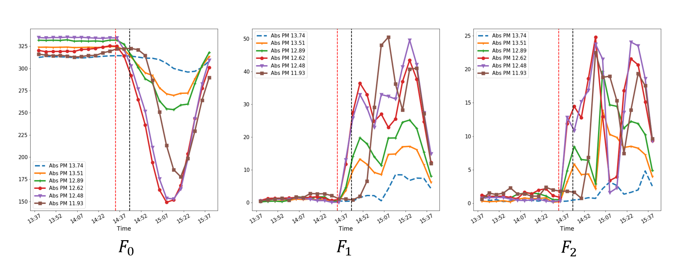

Various informative (time domain and frequency domain) features can be extracted from the raw speed readings that can facilitate the detection of accidents. 

# Time-Domain Features

We conisder 11 time-domain features:
<pre>
1. Mean                             7. Mean Absolute Deviation
2. Median                           8. Skewness
3. Standard deviation               9. Kurtosis
4. Root mean square                 10. Mean of Maxima
5. Energy                           11. Mean of Minima
6. Inter Quartile Range
</pre>

These features are computed via a rolling window approach. For example, feature mean is computed as follows:

$$ Z_k = \frac{\sum_{i=0}^{N-1} Y_{k-i}}{N}, $$

where $Z_k$ is the feature at time $k$, $Y_k$ is the speed reading at time $k$, and $N$ is the window length. 

 
The below figure shows the extracted time-domain features when N=5, for the accident reported on absolute postmile (Abs PM) 13.6 at 2:44pm on January 1st, 2020. See the coressponding raw speed readings [here.](./data_collect.html)

 
 
# Frequency-Domain Features

1. Discrete Fourier Transform
 
   We compute the discrete fourier transform by consider a window of size $N$ at each time $k$ as follows:

   $$ F_n^k = \sum_{i=0}^{N-1} Y_{k-i} e^{-j\frac{2\pi}{N}ni}, $$

   where $F_n^k$ is the $n$th frequency component at time $k$.

   Since the speed observations are real values, we get a symmetric spectrum aroung $N/2$. Hence, we consider magnitudes of the d.c. component or the zero frequency component $F_0^k$, the fundermental frequency component $F_1^k$ and all its harmonics up to $N/2$ as features at time $k$. 

   Further, to speed-up the process of computing these features, we utilize a fast-fourier transform algorithm, i.e., Cooley-Tukey algorithm to compute discrete fourier transform, which reduce the number of computations from $\mathcal{O}(N^2)$ to $\mathcal{O}(Nlog(N))$. 
   
   The below figure shows the extracted frequency components (magnitudes) when N=5, for the accident reported on absolute postmile (Abs PM) 13.6 at 2:44pm on January 1st, 2020. See the coressponding raw speed readings [here.](./data_collect.html)

  

   
  

2. Karhunen Lo\'eve Expansion (Eigenvector Transform)

   The Karhunen Lo\'eve Expansion (KLE) decomposes a time-domain signal into uncorrelated spectral components to highlight its unique frequency domain characteristics.

   Let $Y^k =[Y_{k},Y_{k-1},\dots,Y_{k-N-1}]$ be the signal window of size $N$ at time $k$. Consider $\lbrace q_{0},q_{1},\dots,q_{N-1} \rbrace $ to be the eigen vectors of the $N \times N$ autocorrelation matrix corresponding to $Y^k$. Then the KLE of the signal $Y^k$ is given by,

   $$ Y^k =\sum_{i=0}^{N-1} q_{i}^{T} Y^k q_{i}.$$

   Thus, signal $Y^k$ is decomposed into $N$ mutually uncorrelated spectral components $S_{0}^k, S_{1}^k,\dots,S_{N-1}^k$, where $S_{i}^k= q_{i}^{T} Y^k q_{i}$. These uncorrelated spectral components are called the subspace components of the signal $Y^k$. We consider all these subspace components as features at time $k$.

   Note that each eigenvector $q_{i}$ can be viewed as coefficients of a Finite Impulse Response (FIR) digital filter and thus, $S_{i}^k$ is the output of the filter realized by $q_{i}$.
   
   The below figure shows the extracted subspace components when N=5, for the accident reported on absolute postmile (Abs PM) 13.6 at 2:44pm on January 1st, 2020. See the coressponding raw speed readings [here.](./data_collect.html)
 
   

  	 
   

   
[Back](../)
