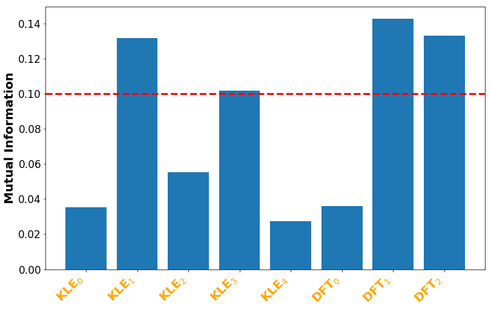

In feature selection, our goal is to select a subset of most informative features (out of all extracted features [here](./feat_extract.html)) for accident detection. 

## Information Theoretic Feature Selection

### Mutual Information [^1]

$$ I(X;Y) = \sum_{y \in Y} \sum_{x \in X}  { P(x,y) \log{ \left(\frac{P(x,y)}{P(x)P(y)} \right) }} $$

Mutual information is a measure of the mutual dependence between the two variables. Specifically, it quantifies the amount of information obtained about one random variable through observing the other random variable. 

In our accident detetecion problem, in order to compute the amount of information that each feature contains to discriminate a time sample between normal traffic versus accident condition, we assign a binary label for each time sample. Specifically, we use $1$ to repesent an accident sample, while $0$ represents a normal traffic sample. 


Hereafter, we call this variable as the ''accident variable'' $\mathcal{A}$. Then, we compute mutual information between each feature and $\mathcal{A}$. 

<details> <summary> <b> Show Code </b> </summary>
  
```python
from sklearn.metrics import adjusted_mutual_info_score

def quantize_fspace(feat,bins): 
    """
    Quantize feature array
    Args:
        feat: feature array
        bins: quantization levels
    Return: 
        q_feat: quantized feature array
    """ 
    min_r = np.floor(min(feat))
    max_r = np.ceil(max(feat))
    Edges = np.linspace(min_r, max_r, num=bins+1)
    q_feat = np.digitize(feat,bins=Edges)       
    return q_feat


def mutual_info(feat,label,bins):
    """
    Compute mutual information with accident variable
    Args:
        feat: feature array
        label: accident variable
        bins:  
    Return: 
        mi = mutual information
    """ 
    q_feat = quantize_fspace(feat,bins) #quantize the feature array
    mi = adjusted_mutual_info_score(q_feat,label)
    return mi
    
```
</details>

### Time Domain Features


### Frequency Domain Features

<p align="center">  </p>

$$\text{KLE}_0, \text{KLE}_1, \text{KLE}_2, \text{KLE}_3, \text{KLE}_4 : \text{Eigenvector Transform Coefficients} $$
$$\text{DFT}_0, \text{DFT}_1, \text{DFT}_2 : \text{Discrete Fourier Transform Coefficients} $$

We select a subset of most informative features (in both time domain and frequency domain) for accident detection based on a threshold $\alpha$ on the mutual information between each feature and the accident variable.

<details> <summary> <b> Show Code </b> </summary>
  
```python
def mi_bar_plot(mi,feat_name):  
    """
    Bar plot of mutual information between features and accident variable
    Args:
        mi: mutual information array
        feat_name: feature names
    Return: 
        None: plot and save a bar plot of mutual information array
    """    
    fig = plt.figure(figsize=(18,8))
    plt.bar(range(len(mi)),mi)    
    plt.xticks(range(11),feat_name, color='orange', rotation=45, fontweight='bold',
                               fontsize='17', horizontalalignment='right')
    
    #plot threshold at 0.1
    plt.axhline(y=0.1,color='r',linestyle='--',linewidth=3,label = '')
    
    #stylish adjustments
    plt.rcParams['xtick.labelsize'] = 17
    plt.rcParams['ytick.labelsize'] = 17
    plt.ylabel('Mutual Information',fontweight='bold',fontsize=20)
    
    #save the figure as .png
    plt.savefig('Figures/mi.png', format='png',bbox_inches='tight')

#time domain features bar plot 
feature_name =['Mean','Median','STD','RMS','Energy','IQR','Mean AD','Skewness',
                   'Kurtosis','Mean of Max','Mean of Min']
mi_bar_plot(mi_time,feat_name)

#frequency domain features bar plot 
feature_name =['KLE$_0$','KLE$_1$','KLE$_2$','KLE$_3$','KLE$_4$','DFT$_0$'
                                   ,'DFT$_1$','DFT$_2$']
mi_bar_plot(mi_freq,feat_name)

```
</details>

Here are the 7 selected features when  $\alpha =0.1$.

<pre>
1. Mean Absolute Deviation                                                    
2. Standard deviation               
3. DFT Coefficient 1                 
4. DFT Coefficient 2
5. KLE Coefficient 1
6. Inter Quartile Range
7. KLE Coefficient 3
</pre>

[Next](../pages/classify.html)

[Go Back](../)

### References
[^1]: C. E. Shannon, “A mathematical theory of communication,” Bell system technical journal, vol. 27, no. 3, pp. 379–423, 1948.

