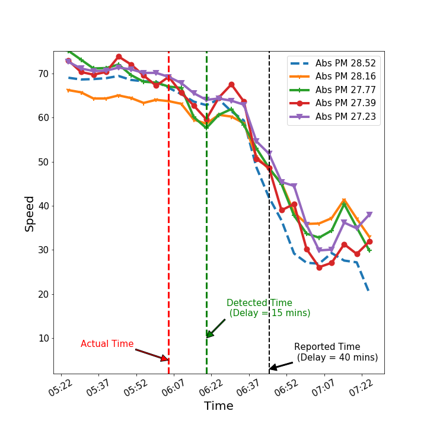

## Experimental Setup

We evaluate our proposed three–stage approach on a real–world dataset. (See [here](./data_collect.html) for details on real-time data collecting process). Specifically, we consider a set of 80 accident events from the event dataset and train our model on 60 (randomly selected) events and test on the rest 20 events.

During model training, we basically learn conditional probability distributions for all selected features under the assumption that:

$$F_i|\mathcal{A}=j \sim \mathcal{N} (\mu_{ij},\sigma^2_{ij})$$ 

During testing, at each time step, we:
1. extract the set $F$ of selected features
2. compute the sufficient statistic $\pi$
3. obtain the optimum decision $D_{F}^\text{optimum}$

The above three steps are repeated until an accident is detected (i.e., $D_{F}^\text{optimum}$ = 1), at which point an alert is raised, and the process of extracting features resumes. Note that in step 2, $\pi$ can be computed using conditional probability distributions as follows:

$$ \pi = P(\mathcal{A} = 0 | F) = \frac{P(F|\mathcal{A} = 0 )P(\mathcal{A} = 0 )}{P(F)} = \frac{ \prod_{i} P(F_i|\mathcal{A} = 0 )P(\mathcal{A} = 0 )}{\sum_j \prod_{i} P(F_i|\mathcal{A} =j)}, $$

where the prior probability $P(\mathcal{A} = i), i \in \lbrace 0,1 \rbrace$ is estimated using training data. Finally, we set constant misclassification costs, i.e. $Q_{10} =0.6, Q_{01}=0.4, Q_{00}=0, Q_{11} =0$.

<details> <summary> <b> Show Code </b> </summary>
    
```python
from sklearn.naive_bayes import GaussianNB

############################### Training #########################################
#seleted features
SF = [3,6,7,13,15,18,19]   # when alpha = 0.1  (STD,IQR,MAD,KLE1,KLE3,DFT1,DFT2)
#SF = [3,6,7,13,18,19]     # when alpha = 0.12 (STD,IQR,MAD,KLE1,DFT1,DFT2)
#SF = [3,7,18]             # when alpha = 0.14 (STD,MAD,DFT1)

#initialize
Xtrain = []
Ytrain = []
init1 = False

#train using first 60 events
for i in range(60):    
    init2 = False
    #compute all selected features and stack into a single feature vector
    for j  in range(len(SF)):        
        F = Train_event(Speed_data,Event_data,Actual_times,Event_ids[i],SF[j],5)       
        if not init2:
            X = np.array(F)[:,:5]
            init2 = True
        else:
            X = np.column_stack((np.array(F)[:,:5],X))
    
    Ytrain.extend(list(F['label']))             #training accident labels
    if not init1:
        Xtrain = X
        init1 = True
    else:
        Xtrain = np.concatenate((X,Xtrain))     #training feature vectors  

#learn conditional probability distributions using Xtrain and Ytrain
clf = GaussianNB()
clf.fit(Xtrain, Ytrain)

############################### Testing  ########################################
#initialize
Delay = []
Miss_detect = 0
False_alarm = 0
Reported_delay = []

#miss-classification costs
Q_00,Q_10,Q_01,Q_11 = 0,0.6,0.4,0

#test the performance on the remaining 20 events 
for i in range(60,80):    
    #initialize
    detect = False
    init2 = False
    
    #compute all selected features and stack into a single feature vector
    for j  in range(len(SF)):             
        F_j,AT,time,RT = Test_event(Speed_data,Event_data,
                                        Actual_times,Event_ids[i],SF[j],5)       
        if not init2:
            X = np.array(F_j)
            init2 = True
        else:
            X = np.column_stack((np.array(F_j),X))
            
    for j in range(len(X)):
        F = X[j,:]                             #step1: extract feature vector F
        
        pi = clf.predict_proba([F])[0]         #step2: compute pi
        
        D_F = np.argmin([Q_00*pi+Q_10*(1-pi),
                         Q_01*pi+Q_11*(1-pi)]) #step3: predict optimum decision D_F
        
        if D_F ==1:
            detect = True
            if AT<time[j]:
                delay = (time[j]-AT).seconds/60
                Delay.append(delay)
            else:
                delay = -(AT-time[j]).seconds/60
                #if delay <-10, increment false alarms by 1
                if delay < -10:
                    False_alarm +=1
                else:
                    Delay.append(0)
            break
    #if not detected, increment miss detections by 1
    if not detect:
        Miss_detect +=1
    #reported delay
    Reported_delay.append((RT-AT).seconds/60)

####################   Performance Measures  #####################################
PMD = Miss_detect/20
PFA = False_alarm/20
Avg_D = np.mean(Delay)
Reported_Avg_D = np.mean(Reported_delay)

#############   Helper-functions used in Training and Testing  ####################
def Train_event(Speed_data,Event_data,event_id,actual_times,feature,window):
    """
    Create training data for a specified event
    Args:
        Speed_data: Speed dataset 
        Event_data: Event dataset
        event_id: Unique id of the event 
        actual_time: Suspected accident times     
        feature: feature index
        window: rolling window size
    Return: 
        Feature: a datafram with feature vectors and accident variable for the event specified by 'event_id'
    """ 
    #event information
    Event_info = Event_data[Event_data['Incident_ID'] == event_id]   
    Acc_place = Event_info.iloc[0,3]    
    Acc_time = Actual_times[Actual_times['Incident_id'] == event_id].iloc[0,1]
    
    #extract speed readings 2 hour before and 1/2 hour after
    start_t = Acc_time - timedelta(minutes= 120) 
    end_t = Acc_time + timedelta(minutes= 30)   
    Event_speed =  Speed_data[(Speed_data.Time <=  end_t  ) & (Speed_data.Time >= start_t)] 
         
    #extract 5 sensors with close proximity to accident
    Link_IDs['Diff'] = Link_IDs.Postmile.values-Acc_place
    Upstream = Link_IDs[Link_IDs.Diff <=0].sort_values(['Diff'],ascending= False)
    Downstream =  Link_IDs[Link_IDs.Diff > 0].sort_values(['Diff'],ascending= True)
    Link_IDS = [Downstream.iloc[0,0],Upstream.iloc[0,0],Upstream.iloc[1,0],
                                   Upstream.iloc[2,0],Upstream.iloc[3,0]]
    
    #create a concatanated dataframe with features
    Feature = pd.DataFrame()
    for i,z in enumerate(Link_IDS):
        #sensor speed data
        Link_data = Event_speed[Event_speed['Link_ID']== z]                                     
        data = Link_data[['Time','Speed']]
        sorted_data = data.sort_values(['Time'])
        sorted_data1 = sorted_data.set_index(['Time']) 
        
        #interpolation filter incase of missing samples
        resampled_data = sorted_data1.resample('5T').mean()  
        interpolated = resampled_data.interpolate(method='linear')
        
        #compute features from speed array
        feat = window_feature(interpolated.Speed,feature,window)
        Feature['S'+str(i+1)] = feat
        
    # accident variable
    Feature['label']= [0 if x < Acc_time else 1 for x in interpolated.index][window-1:]    
    return Feature

def Test_event(Speed_data,Event_data,event_id,actual_times,feature,window):     
    """
    Create testing data for a specified event
    Args:
        Speed_data: Speed dataset 
        Event_data: Event dataset
        event_id: Unique id of the event 
        actual_time: Suspected accident times     
        feature: feature index
        window: rolling window size
    Return: 
        Feature: a datafram with feature vectors of the event 
        time: datetime array corresponding to the event 
        Acc_time: Actual time of the event
        Reported time: Reported time by Cali. Highway Petrol
    """ 
    #event information
    Event_info = Event_data[Event_data['Incident_ID'] == event_id]   
    Acc_place = Event_info.iloc[0,3]    
    Acc_time = Actual_times[Actual_times['Incident_id'] == event_id].iloc[0,1]
    Reported_time= Event_info.iloc[0,1]
    
    #extract speed readings  1 hour before and 1 hour after
    start_t = Acc_time - timedelta(minutes= 60 ) 
    end_t = Acc_time + timedelta(minutes=60)   
    Event_speed =  Speed_data[(Speed_data.Time <=  end_t  ) & (Speed_data.Time >= start_t)] 
       
    
    #extract 5 sensors with close proximity to accident
    Link_IDs['Diff'] = Link_IDs.Postmile.values-Acc_place
    Upstream = Link_IDs[Link_IDs.Diff <=0].sort_values(['Diff'],ascending= False)
    Downstream =  Link_IDs[Link_IDs.Diff > 0].sort_values(['Diff'],ascending= True)
    Link_IDS = [Downstream.iloc[0,0],Upstream.iloc[0,0],Upstream.iloc[1,0],
                                   Upstream.iloc[2,0],Upstream.iloc[3,0]]
    
     #create a concatanated dataframe with features
    Feature = pd.DataFrame()
    for i,z in enumerate(Link_IDS):
        #sensor speed data
        Link_data = Event_speed[Event_speed['Link_ID']== z]                                     
        data = Link_data[['Time','Speed']]
        sorted_data = data.sort_values(['Time'])
        sorted_data1 = sorted_data.set_index(['Time']) 
        
        #interpolation filter incase of missing samples
        resampled_data = sorted_data1.resample('5T').mean()  
        interpolated = resampled_data.interpolate(method='linear')
        
        #compute features from speed array
        feat = window_feature(interpolated.Speed,feature,window)
        Feature['S'+str(i+1)] = feat
    
    #datetime array
    time = interpolated.index 
    return Feature,time,Acc_time,Reported_time
######################### That's all Folks! ######################################

```
</details>

## Results and Discussion

Following figure shows the performance of our approach on an example accident event (when $\alpha$ is set to 0.1).

<p align="center">
       
</p>

We consider probability of false alarm (PFA), probability of miss-detection (PMD) and avarage detection delay (ADD) as performance measures. We report results for three different threshold $\alpha$ values on the mutual information. 

    
|            |  $\alpha=0.10$ |  $\alpha=0.12$ |  $\alpha =0.14$     | Cali. Highway Patrol   |
|:---------: | :-------------: | :-------------: | :-------------: | :--------------------: |
|    # Selected features    |     7     |      6       |      3        |         N.A.            |
|   PFA        |      0.0       |      0.0       |      0.0        |         0.0            |
|   PMD           |      0.0       |      0.0       |      0.05        |         0.0            |
|   ADD (mins)     |      3.75         |      3.75         |      5.0        |         16.45            |


    
|            |  $T=3$ |  $T=5$ |  $T=7$     | Cali. Highway Patrol   |
|:---------: | :-------------: | :-------------: | :-------------: | :--------------------: |
|    # Selected features    |     5     |      6       |      5        |         N.A.            |
|   PFA        |      0.0       |      0.0       |      0.30        |         0.0            |
|   PMD           |      0.0       |      0.0       |      0.05        |         0.0            |
|   ADD (mins)     |      6.80         |      3.75         |      2.31        |         16.45            |


[Go Back](../)

